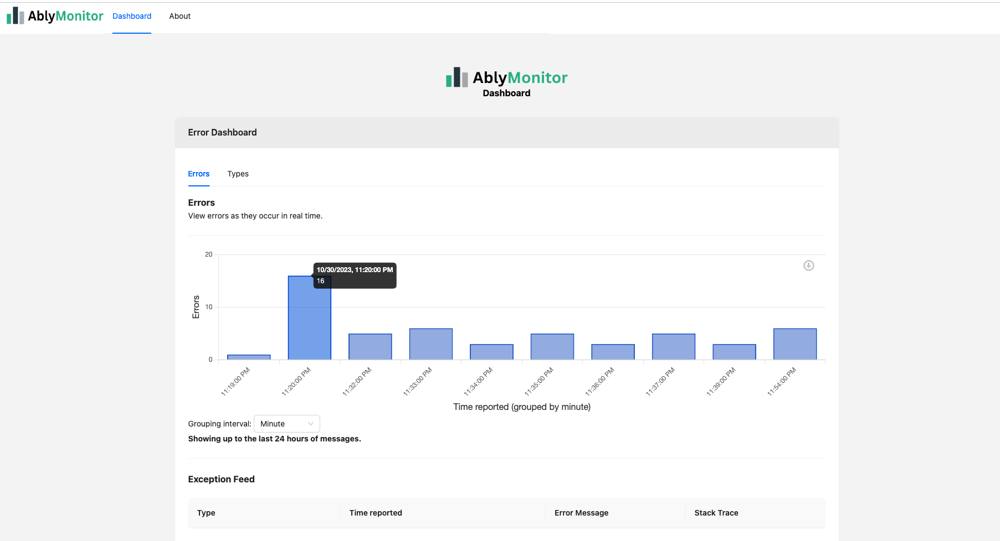
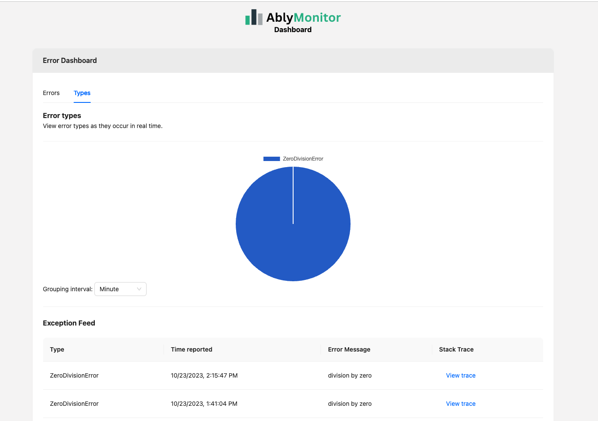
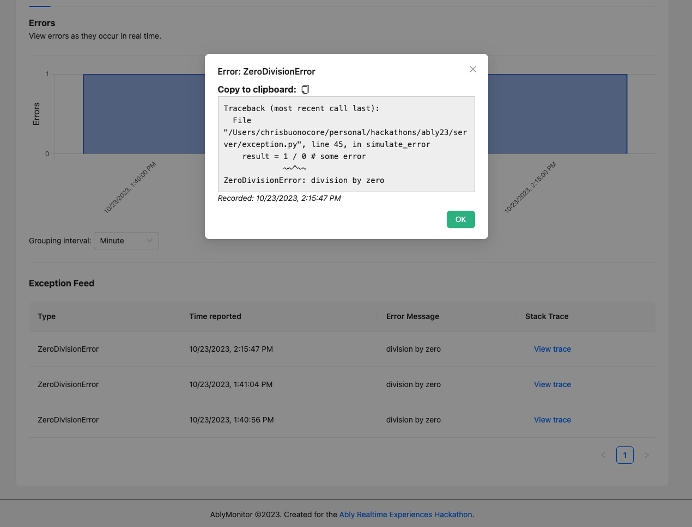
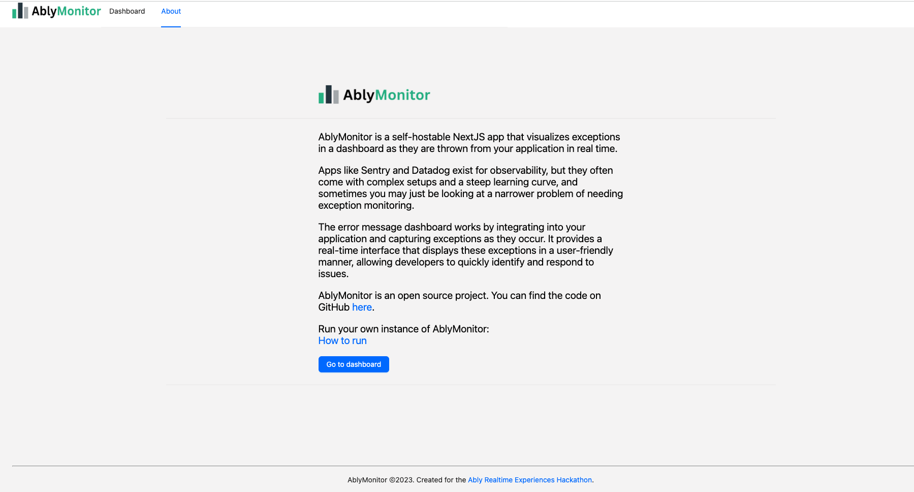
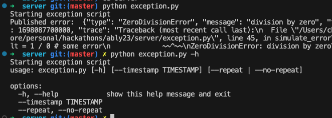

AblyMonitor
---

AblyMonitor is a self-hostable NextJS app that visualizes exceptions in a dashboard as they are thrown from your application in real time.

Demo Video:

Live URL: https://ably-monitor.vercel.app/

### Inspiration

Apps like Sentry and Datadog exist for observability, but they often come with complex setups and a steep learning curve, and sometimes you may just be looking at a narrower problem of needing exception monitoring. 

### How it works

AblyMonitor works by integrating into your application and capturing exceptions as they occur. It provides a real-time dashboard that displays these exceptions in a user-friendly manner, allowing developers to quickly identify and respond to issues.

Ably also supports real time use cases nicely and provides some persistence for messages, enabling a 24 hour retention for free with sent messages. In production use cases, this could be extended by adding a backend API that can store and retrieve longer history much like a Datadog or Sentry.

### Running the dashboard

To run AblyMonitor, follow these steps:

1. Add your varaiables to `.env.sample` in the root and ./server folders. Copy to an equivalent `.env` file. These files contain your Ably key and desired channel for message passing for the app.

2. Install the necessary dependencies using `yarn`.

3. Start the dashboard by running `yarn dev`.

4. [Optional] You can also run the Python error generation script to simulate errors (used in demo video). In the project's server directory, install necessary dependencies and execute `python exception.py`.

### Sending messages

`exception.py` simulates an exception coming from a production server in practice.

To use AblyMonitor, simply self host the front end project, and connect up `publish_exception` like the below with your channel configuration.

<pre>
# This could be called in a production context with access to an Ably channel.

async def publish_exception(channel , e: Exception):
    message = CustomException(e).get_json()
    result = await channel.publish('exception', message)
    print('Published error: ', message)
</pre>

## Challenges we ran into
1. Ensuring real-time exception capture and synchronization with the dashboard.
2. Managing the scalability and performance of the system as exceptions poured in.
3. Implementing a user-friendly and intuitive dashboard interface.

## Accomplishments that we're proud of
It works.

## What we learned
1. Real-time data synchronization and handling in a web application using the Ably server and client sdks.
2. The nuances of basic exception capture and presentation.
3. The importance of user experience and interface design in monitoring tools.

## Potential future work
1. Adding support for more programming languages and frameworks.
2. Implementing intelligent exception categorization and prioritization.
3. Expanding integration options with popular application monitoring and alerting systems.

## Screenshots

### Dashboard (Errors)

### Dashboard (Types)

### Trace details

### About

### Exception script

## Useful links
* https://ably.devpost.com/
* https://ably.com/docs

